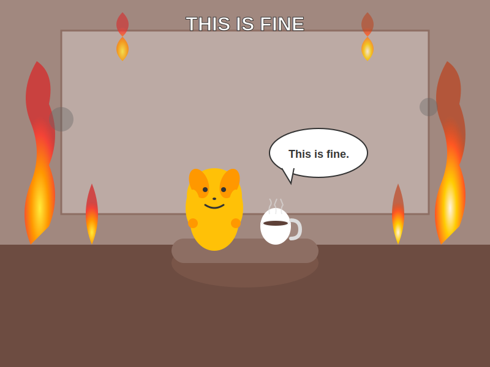
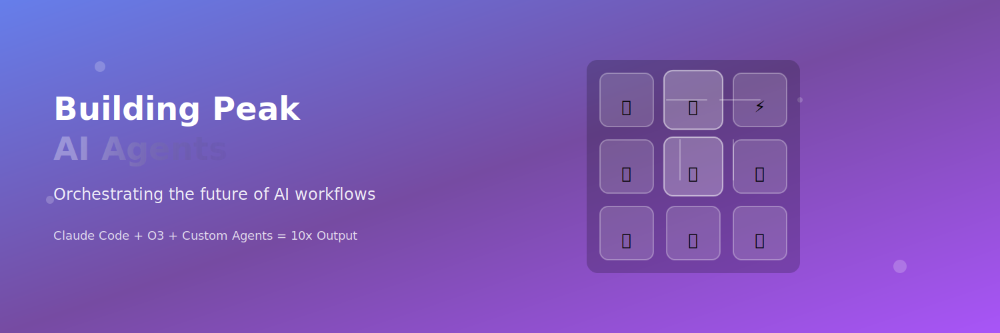

# Claude Diagram Creator

Create stunning diagrams, architecture visualizations, and professional graphics instantly with Claude Code. Just describe what you want, and Claude generates beautiful, presentation-ready visuals.

**⚡ Requires [Claude Code](https://claude.ai/code) - This workflow creates professional diagrams and visualizations, not just simple SVGs.**

## What You Can Create

### AWS Architecture Diagram


### Viral Meme Recreation - This is Fine


### LinkedIn Banner


### Twitter/X Header


### Neural Network Visualization


## Creating Your Own

Simply ask Claude to create any diagram or visualization:

```
"Create an AWS architecture diagram with load balancers, Lambda, and RDS"
```

```
"Design a flowchart showing user authentication flow"
```

```
"Make a network topology diagram for my data center"
```

```
"Create a beautiful LinkedIn banner for a DevOps engineer"
```

Claude will generate a high-quality diagram and save it with a descriptive name.

## Getting Started with Claude Code

1. **Install Claude Code** from [claude.ai/code](https://claude.ai/code)
2. **Clone this repository** to your working directory
3. **Ask Claude** to create any diagram you need
4. **Find your diagram** in the project directory

## What Makes This Special

- **Professional Quality** - Not just basic SVGs, but presentation-ready diagrams
- **Smart Layouts** - Claude automatically arranges elements for clarity
- **Beautiful Styling** - Gradients, shadows, animations, and modern design
- **Export Ready** - Use the HTML template to export as PNG, JPEG, or WebP
- **Customizable** - Request specific colors, styles, or branding

## Tips for Best Results

- **Be specific** - "AWS diagram with API Gateway, Lambda, and DynamoDB in separate VPC subnets"
- **Mention the purpose** - "for a presentation" or "for documentation"
- **Request styles** - "Make it minimal" or "Use blue and green colors"
- **Specify type** - "architecture diagram", "flowchart", "network topology"

### Talk to Claude Like a Designer

Claude can handle specific design instructions just like you'd give to a human designer:

- "Move the Lambda function 2 inches to the right"
- "Make the database icon 50% larger"
- "Add more space between the load balancer and the servers"
- "Move the title down a bit, it's too close to the edge"
- "The connection lines are overlapping, route them around the services"
- "Make the AWS logo smaller and put it in the corner"
- "The text is hard to read, make it white with a dark background"

Don't hesitate to iterate - Claude will remember the context and make precise adjustments!

## Troubleshooting

**Claude not creating diagrams?**
- Make sure you're using Claude Code (not regular Claude)
- Mention "diagram" or "visualization" in your request

**Need different formats?**
- Open the generated HTML file in a browser
- Use the export controls for PNG/JPEG/WebP

**Want to modify?**
- Ask Claude to update: "Make the boxes larger" or "Change to dark theme"

## Contributing

This workflow is designed for Claude Code users. Contributions welcome:
- New diagram templates
- Style improvements
- More examples

Submit issues and PRs on GitHub.

## License

MIT License - Free to use and modify

---

**Made for Claude Code** - Professional diagrams and visualizations in seconds