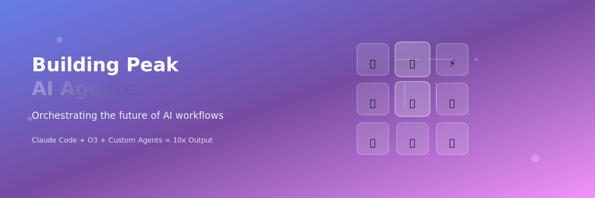

# Claude Code Visualization Workflow

A powerful visualization workflow designed specifically for use with **Claude Code** - enabling instant creation of professional architecture diagrams and technical visualizations with built-in export capabilities.

## 🎯 Quick Start

1. **See Examples First** - Open any of the example files to see what's possible:
   - `example-linkedin-banner.html` - Professional social media banner
   - `example-twitter-banner.html` - Eye-catching header with animations
   - `example-neural-cosmos.html` - Mind-blowing animated AI visualization

2. **Create Your Own** - Just ask Claude:
   ```
   Using the visualization template, create a diagram showing my AWS architecture
   ```

3. **Export** - Open the generated HTML and click Download!

## 🚀 Why Claude Code?

This workflow is optimized for Claude Code because:
- **AI-powered generation** - Claude understands your requirements and creates complex SVG visualizations
- **Instant iteration** - Describe changes in natural language, see results immediately
- **No manual coding** - Claude handles all the SVG complexity for you
- **Consistent quality** - Claude follows the design guidelines automatically

## Overview

The workflow uses a reusable HTML template with configuration options. Claude Code only needs to generate the SVG content, making the process efficient and consistent.

## Features

- **Reusable template** - One HTML file with all the export logic
- **Multiple export formats** - PNG, JPEG, WebP
- **Configurable resolution** - 1x to 4x scaling
- **Theme switching** - Dark/light preview modes
- **Quality settings** - Adjustable JPEG compression
- **Keyboard shortcuts** - Ctrl/Cmd+S to download
- **No dependencies** - Pure browser-based solution

## How It Works

### 1. Using Claude Code

Simply describe what you want to visualize:

```
Create an architecture diagram showing:
- A load balancer
- Three web servers
- A database cluster
- Cache layer
```

Claude will:
1. Copy the `visualization-template.html`
2. Replace the placeholder SVG with your custom diagram
3. Save it with a descriptive filename

### 2. Viewing and Exporting

1. Open the generated HTML file in your browser
2. Use the controls panel to:
   - Set filename
   - Choose format (PNG/JPEG/WebP)
   - Select resolution (1x-4x)
   - Adjust quality (JPEG only)
   - Switch preview theme
3. Click "Download" or press Ctrl/Cmd+S

## Template Structure

The `visualization-template.html` includes:

```html
<!-- Controls Panel -->
- Filename input
- Format selector
- Resolution options
- Quality slider
- Theme switcher

<!-- SVG Container -->
<svg id="visualization">
  <!-- CLAUDE WILL REPLACE THIS COMMENT WITH SVG -->
</svg>

<!-- Export Logic -->
- Canvas-based conversion
- Multi-format support
- Configurable scaling
```

## Claude Code Instructions

The `CLAUDE.md` file contains specific instructions for Claude to:
- Use the template approach
- Ensure no overlapping elements
- Maintain proper spacing
- Follow design guidelines

## Examples

### Ready-to-Use Examples

We've included three stunning example visualizations to showcase what's possible with Claude Code and this template:

#### 1. **LinkedIn Banner** (`example-linkedin-banner.html`)


A professional LinkedIn banner with:
- Gradient backgrounds with teal/green theme
- Geometric patterns and network visualization
- Typography with gradient text effects
- Optimized for LinkedIn's 1584x396 dimensions

#### 2. **Twitter Banner** (`example-twitter-banner.html`)



An eye-catching Twitter/X header featuring:
- Purple gradient cosmic theme
- 3x3 grid of AI agent nodes with emojis
- Animated floating particles
- Perfect for the 1500x500 Twitter header size

#### 3. **Neural Cosmos** (`example-neural-cosmos.html`)



An outlandish, attention-grabbing visualization showcasing:
- Animated neural networks with glowing effects
- Rotating cosmic rings and data flows
- Binary rain matrix effect
- Particle systems and quantum entanglement visualization
- Multiple animation layers creating a mesmerizing effect

### Creating Your Own

Simply describe what you want to visualize to Claude:

#### Architecture Diagrams
```
"Create a microservices architecture with API gateway, services, and databases"
```

#### Flow Charts
```
"Show a CI/CD pipeline with build, test, and deploy stages"
```

#### Network Diagrams
```
"Visualize a VPC with public/private subnets and security groups"
```

### What Claude Can Create

- **Social Media Graphics** - Banners, posts, headers
- **Technical Diagrams** - Architecture, flow, network
- **Data Visualizations** - Charts, graphs, infographics
- **Creative Art** - Abstract, generative, animated
- **Marketing Materials** - Product showcases, feature highlights
- **Educational Content** - Tutorials, explanations, concepts

## File Organization

```
.
├── README.md                    # This file
├── CLAUDE.md                   # Instructions for Claude Code
├── visualization-template.html  # Reusable template
├── .gitignore                  # Excludes generated files
├── example-linkedin-banner.html # LinkedIn banner example (HTML with export)
├── example-linkedin-banner.svg  # LinkedIn banner SVG
├── example-twitter-banner.html  # Twitter/X header example (HTML with export)
├── example-twitter-banner.svg   # Twitter/X header SVG
├── example-neural-cosmos.html   # Animated AI visualization (HTML with export)
├── example-neural-cosmos.svg    # Neural cosmos SVG
└── *.html                      # Your generated visualizations (ignored)
```

## Advanced Usage

### Custom Themes

Modify the CSS in the template:
```css
/* Your custom theme */
body.custom {
    background: #your-color;
}
```

### Default Settings

Edit the config object:
```javascript
const config = {
    defaultFilename: 'my-diagram',
    defaultFormat: 'png',
    defaultScale: 3,
    defaultQuality: 0.9
};
```

### Batch Processing

You can create multiple visualizations and export them with consistent settings.

## Benefits of This Approach

1. **Efficiency** - Claude only generates the SVG, not the entire HTML
2. **Consistency** - All exports use the same high-quality logic
3. **Flexibility** - Easy to adjust settings without regenerating
4. **Maintainability** - Update the template once, affects all visualizations
5. **User-friendly** - Non-technical users can adjust export settings

## Getting Started with Claude Code

1. **Install Claude Code** (if not already installed)
2. **Copy this repository** to your working directory
3. **Ask Claude** to create a visualization:
   ```
   Using the visualization template, create a diagram showing [your requirements]
   ```
4. **Open the generated HTML** and export your diagram

## Tips for Best Results

- Be specific in your descriptions to Claude
- Request modifications iteratively
- Use the light theme for printing
- Choose 4x scale for presentations
- Use PNG for transparency, JPEG for smaller files

## Troubleshooting

### Claude not using the template?
Make sure to mention "using the visualization template" in your request.

### Export not working?
- Check browser console for errors
- Try a different browser
- Ensure JavaScript is enabled

### Large diagrams?
- Increase the SVG viewBox dimensions
- Use lower scale factor for very large diagrams

## Contributing

This workflow is designed for Claude Code users. Contributions welcome:
- Template improvements
- Additional export formats
- New theme options
- Documentation updates

## License

MIT License - Free to use and modify

---

**Made for Claude Code** - The AI-powered way to create professional visualizations